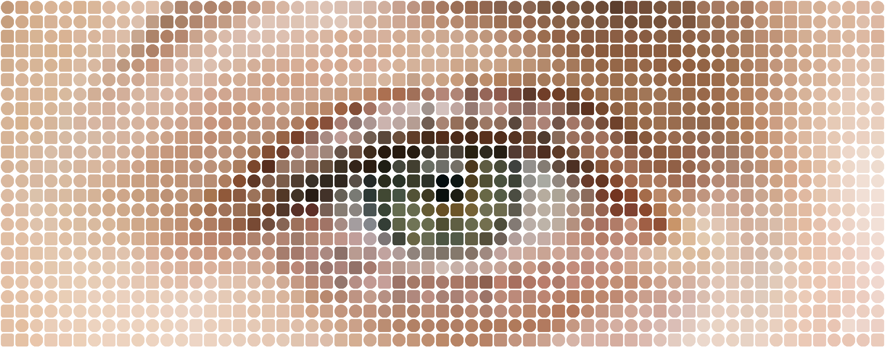
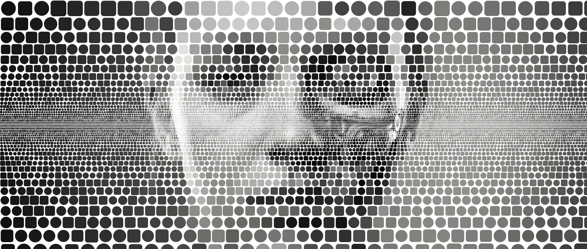
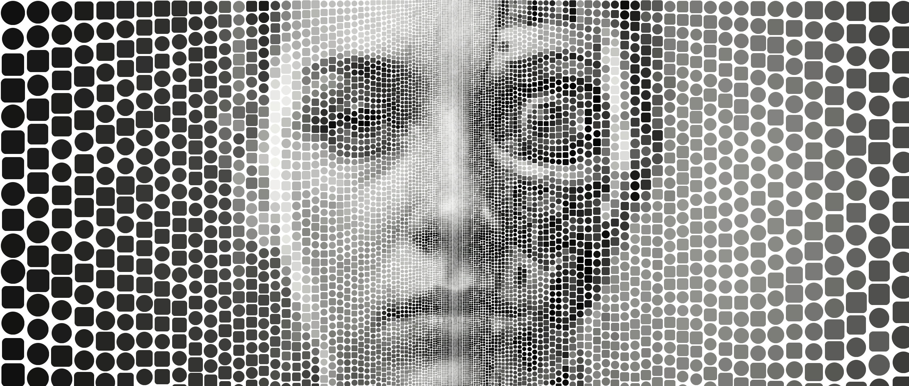
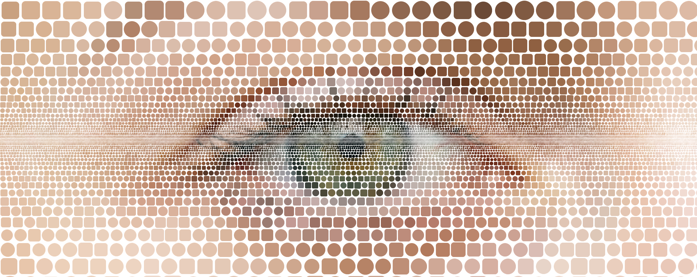
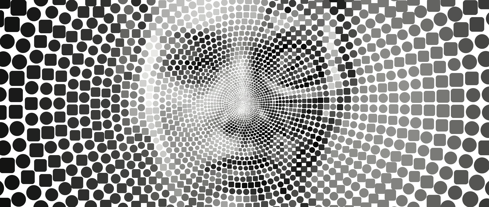
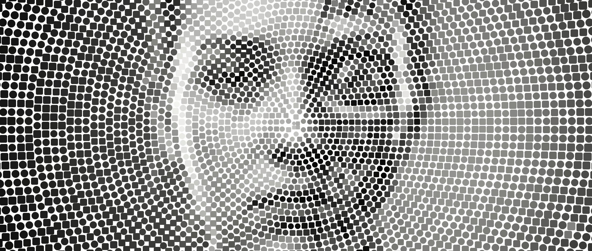
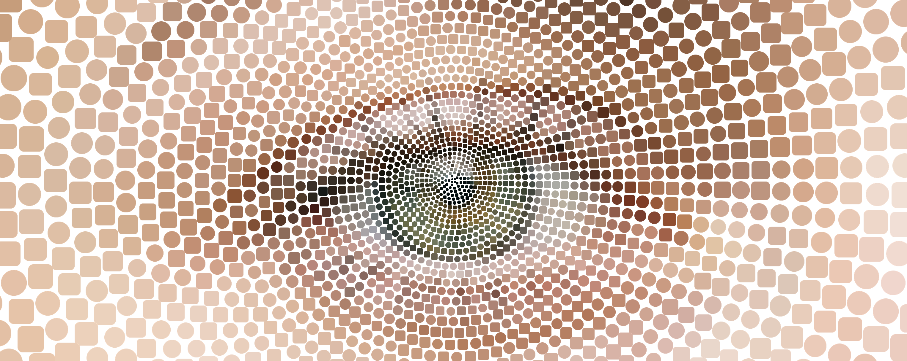

# Mosaic Image and Video Generator

A Python 3.13 tool that converts input images into an artistic grid of Rounded Squares and Circles, outputting either static images or smooth video transitions between different mosaic configurations. It analyzes the color of grid areas in your image and renders filled shapes to recreate the image with a modern, geometric aesthetic.



## Prerequisites

* **Python 3.13** (Required)
* **Poetry** (Recommended package manager)

## Installation

This project uses [Poetry](https://python-poetry.org/) to manage dependencies and virtual environments automatically.

1. **Clone or Download** this project folder.
2. **Open your terminal** in the project folder.
3. **Install dependencies**:
```bash
poetry install
```

*(This command automatically creates a virtual environment and installs Pillow, numpy, and opencv-python into it.)*

If you are not using Poetry, you can install the dependencies via pip using the provided `requirements.txt`:
```bash
pip install -r requirements.txt
```

---

## Usage

Because the project is configured with Poetry scripts, you can run the tool directly using `poetry run mosaic`.

### Syntax

**Static Image Mode** (Outputs `.png` or original format)
```bash
# Standard Mode
poetry run mosaic <input_image> [--grid_size SIZE] [--blur_factor BLUR]

# Gradient & Special Modes
poetry run mosaic <input_image> --mode gradient --spatial_start_size START --spatial_end_size END [--blur_factor BLUR]
poetry run mosaic <input_image> --mode supersample --spatial_start_size START --spatial_end_size END
poetry run mosaic <input_image> --mode centervert --spatial_start_size START --spatial_end_size END
poetry run mosaic <input_image> --mode centerhoriz --spatial_start_size START --spatial_end_size END
poetry run mosaic <input_image> --mode radial --spatial_start_size START --spatial_end_size END
```

**Video Animation Mode** (Outputs `.mp4`)
```bash
# Standard Temporal Interpolation (Constant grid size across the image, zooming in/out over time)
poetry run mosaic <input_image> --video [FRAMES] --grid_size START_SIZE --grid_size_temporal_end END_SIZE

# Spatial + Temporal Interpolation (Morphing a gradient pattern over time)
poetry run mosaic <input_image> --mode radial --video [FRAMES] \
  --spatial_start_size S_START --spatial_end_size S_END \
  --spatial_start_size_temporal_end T_START --spatial_end_size_temporal_end T_END
```

### Arguments

* **`input_image`**: (Required) Path to source image (jpg, png, etc).
* **`--mode`**: (Optional) Rendering mode. Choices: `standard`, `gradient`, `supersample`, `centervert`, `centerhoriz`, `radial`. Default is `standard`.
* **`--grid_size`**: (Optional) Integer. Uniform grid size used in `standard` mode. Default: 30.
* **`--blur_factor`**: (Optional) Float. Controls softness of dots (0.0 = sharp, 0.4 = fuzzy).

#### Spatial Interpolation Arguments (For Gradient/Radial modes)
Controls how sizes interpolate *across the canvas on a single frame*.
* **`--spatial_start_size`**: Grid size at the **starting point** (Left for gradient, **Center** for center/radial modes).
* **`--spatial_end_size`**: Grid size at the **ending point** (Right for gradient, **Edges/Corners** for center/radial modes).

#### Temporal Interpolation Arguments (For Video generation)
Controls how sizes interpolate *across time from the first frame to the last frame*.
* **`--video [frames]`**: Generates an `.mp4` video. Optional frame count (default 60).
* **`--grid_size_temporal_end`**: The target `grid_size` for the *final frame* of the video (used in `standard` mode).
* **`--spatial_start_size_temporal_end`**: The target `spatial_start_size` for the *final frame* of the video.
* **`--spatial_end_size_temporal_end`**: The target `spatial_end_size` for the *final frame* of the video.

*(Note: If a temporal end argument is omitted, the video will keep that parameter constant throughout the duration, matching your starting parameters).*


### Video Generation (API Only)
While the CLI generates video exports, you can also leverage the Python API directly.
```python
from mosaic import Mosaic, MosaicSettings

mosaic = Mosaic("portrait.jpg")

start_settings = MosaicSettings(int_grid_size=10, float_blur_factor=0.0)
end_settings = MosaicSettings(int_grid_size=80, float_blur_factor=0.2)
duration_frames = 60

mosaic.generate_video(start_settings, end_settings, duration_frames, "output.mp4")
```


### Examples

**1. Basic conversion (uses defaults):**

```bash
poetry run mosaic portrait.jpg
```

**2. Specifying grid size:**

```bash
poetry run mosaic landscape.png --grid_size 40
```

**3. High detail (small dots):**

```bash
poetry run mosaic dog.jpg --grid_size 8
```

**4. Abstract (large dots):**

```bash
poetry run mosaic profile.jpg --grid_size 50
```

---

**5. Gradient (Variable Grid):**

```bash
poetry run mosaic landscape.jpg --mode gradient --spatial_start_size 0 --spatial_end_size 80 --blur_factor 0.1
```
*Transitions from full detail (left) to 80px blocks (right).*

**6. Supersample (High Quality Gradient):**

```bash
poetry run mosaic detail.jpg --mode supersample --spatial_start_size 0 --spatial_end_size 80 --blur_factor 0.1
```
*Same as gradient, but smoother edges at small sizes.*

**7. Center Vertical (Symmetric Columns):**

```bash
poetry run mosaic face.jpg --mode centervert --spatial_start_size 10 --spatial_end_size 60 --blur_factor 0.1
```
*Small detailed 10px cells in the center column, growing to 60px at left/right edges.*

**8. Center Horizontal (Symmetric Rows):**

```bash
poetry run mosaic landscape.jpg --mode centerhoriz --spatial_start_size 5 --spatial_end_size 40 --blur_factor 0.1
```
*Small 5px cells in the middle horizon, growing to 40px at top/bottom.*

**9. Radial Mode (Concentric):**

```bash
poetry run mosaic eye.jpg --mode radial --spatial_start_size 10 --spatial_end_size 50 --blur_factor 0.2
```
*Small 10px cells in the center (pupil), expanding to 50px at the corners. The grid follows a circular pattern with radial spokes.*

---

**10. Generating a Video Animation (Temporal Morphing):**

```bash
poetry run mosaic portrait.jpg --video 60 --grid_size 1 --grid_size_temporal_end 50
```
*Generates a 60-frame `.mp4` video starting at a 1px grid (original image) and morphing into a 50px-blocked mosaic.*

**11. Generating a Video Animation (Temporal + Spatial Morphing):**

```bash
poetry run mosaic test1.png --mode radial --video 90 \
  --spatial_start_size 10 --spatial_end_size 10 \
  --spatial_start_size_temporal_end 10 --spatial_end_size_temporal_end 110 \
  --blur_factor 0.0
```
*Generates a 90-frame video. Starts as a flat 10px mosaic, and animates the outer edges blooming outwards into a 110px radial gradient, while the center stays at 10px.*

---

## Version Check

To verify which version of the tool and Python you are running:

```bash
poetry run mosaic --version
```

## Troubleshooting

**"command not found: poetry"**
You need to install Poetry first. The recommended way is using `pipx`:

```bash
pip install pipx
pipx install poetry
```

**"Python 3.13 not found"**
Poetry tries to use the Python version specified in `pyproject.toml`. Ensure you have Python 3.13 installed on your system. You can tell Poetry to use a specific executable with:

```bash
poetry env use /path/to/python3.13
```

## Gallery

### Source Images

| Test 1 | Test |
| :---: | :---: |
|  |  |

### Generated Samples

#### Standard
**Grid Size 50, No Blur**  
`poetry run mosaic test1.png 50 0.0`


#### Center Gradients
**Center Horizontal (4px to 90px)**  
`poetry run mosaic test1.png centerhoriz 4 90 0.0`


**Center Vertical (4px to 90px)**  
`poetry run mosaic test1.png centervert 4 90 0.0`


**Center Horizontal (Test Image)**  
`poetry run mosaic test.png centerhoriz 4 90 0.0`


#### Radial Gradients
**Radial (6px to 130px)**  
`poetry run mosaic test1.png radial 6 130 0.0`


**Radial (30px to 50px)**  
`poetry run mosaic test1.png radial 30 50 0.0`


**Radial Sample (10px to 110px)**  
`poetry run mosaic test.png radial 10 110 0.0`


#### Video Animation
**Radial Animation (Temporal + Spatial Morphing, 90 frames)**  
`poetry run mosaic test1.png --mode radial --video 90 --spatial_start_size 10 --spatial_end_size 10 --spatial_start_size_temporal_end 10 --spatial_end_size_temporal_end 110 --blur_factor 0.0`  

<video src="output/test_mosaic_radial_90f_tempG_30-30_tempS_110-10_to_10-110_B0.0.mp4" controls="controls" muted="muted" style="max-width:100%; max-height:640px;"></video>
