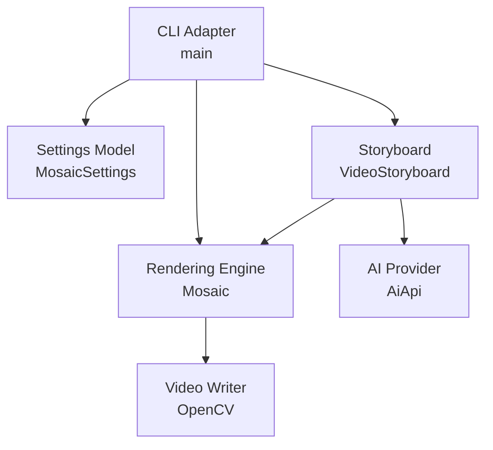
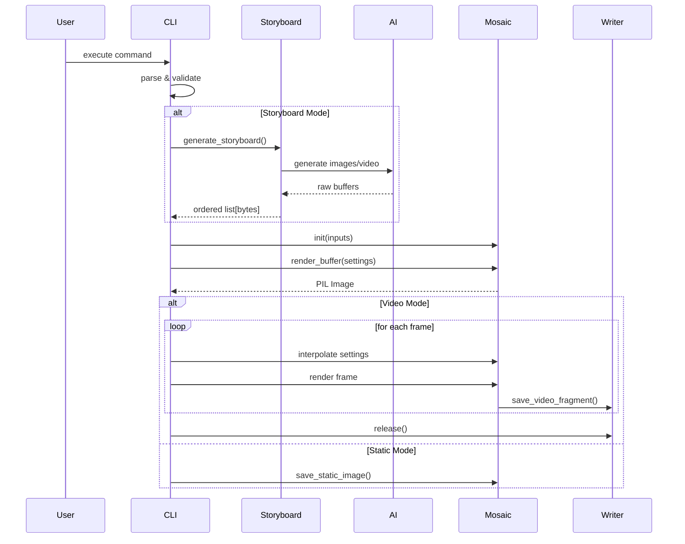
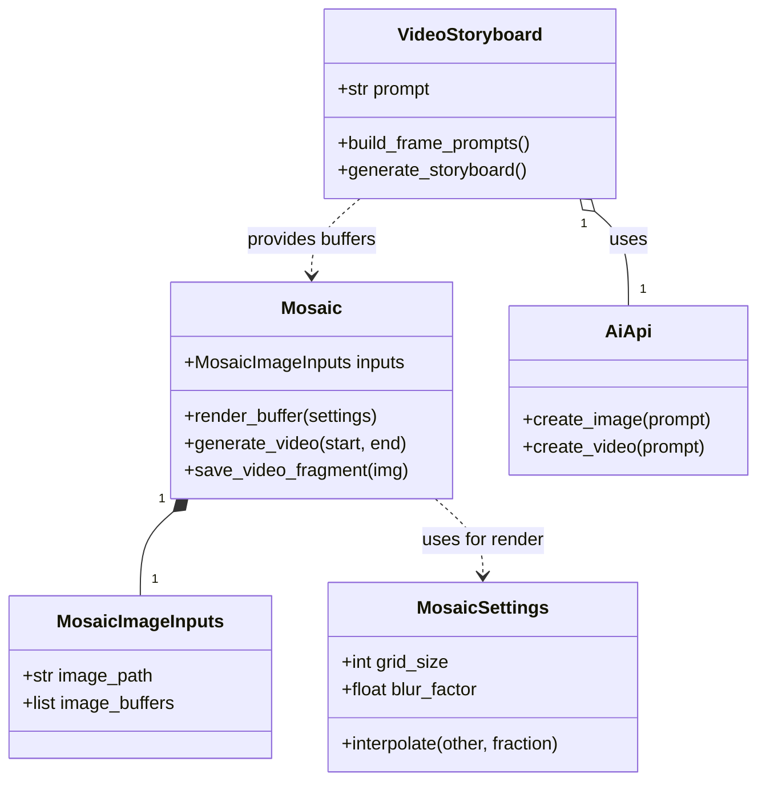

# Mosaic Design Specification

## 1. Document Control

- Project: `mosaic`
- Repository root: `/Users/davidthomas/code/davecthomas/chuckclose`
- Current version: `1.5.0`
- Primary implementation files:
- `src/mosaic/mosaic_generator.py`
- `src/mosaic/mosaic_image_inputs.py`
- `src/mosaic/mosaic_settings.py`
- `src/mosaic/ai_api.py`
- `src/mosaic/__version__.py`
- Supporting files:
- `README.md`
- `pyproject.toml`
- `requirements.txt`
- `env_template.txt`

## 2. Purpose and Scope

This document defines the system design for the Mosaic Image and Video Generator. It covers:

- Runtime architecture
- Module responsibilities
- CLI contracts
- Data flow and rendering algorithms
- Configuration and environment dependencies
- Logging and error-handling strategy
- Security and performance considerations
- Test and release expectations

This is an as-built specification based on the current codebase, with explicit design constraints and recommended hardening items for future iterations.

## 3. Product Overview

The system transforms a source image into a geometric mosaic style using circles and rounded squares.

Supported output types:

- Static mosaic image (`.png` or source extension)
- Time-interpolated MP4 animation (`.mp4`) with parameter tweening

Supported spatial modes:

- `standard`: fixed-size grid
- `gradient`: linear size change across X axis
- `supersample`: linear gradient with supersampled shape rendering
- `centervert`: symmetric X-centered gradient
- `centerhoriz`: symmetric Y-centered gradient
- `radial`: concentric and spoke-based radial layout

Optional AI helper functionality is provided through a dedicated wrapper module for prompt completions and image generation.

## 4. System Context

### 4.1 Primary Actor

- CLI user providing an input image and rendering parameters.

### 4.2 External Systems

- Filesystem (input image read, output image/video write)
- Python runtime and local dependencies (`Pillow`, optionally `opencv-python`, `numpy`, `tqdm`)
- Optional third-party AI backend through `ai-api-unified` and provider credentials

### 4.3 Trust Boundaries

- Untrusted input:
- CLI argument values
- Input image file path and content
- Environment variable values
- Trusted runtime:
- Local process memory and internal rendering logic

## 5. Design Goals

- Deterministic output structure for a given input and parameter set (shape type and jitter intentionally non-deterministic).
- Clear mode-based CLI ergonomics for static and animated generation.
- Reasonable rendering quality with support for blur and supersampling.
- Graceful handling when video dependencies are absent.
- Minimal side effects at import time beyond dependency detection and logger setup.

## 6. Non-Goals

- Web/API service deployment
- Distributed rendering
- GPU acceleration
- Full plugin ecosystem for renderers/providers
- Persistent job queue management

## 7. Repository Layout

Top-level layout:

- `src/mosaic/mosaic_generator.py`: core rendering engine and CLI
- `src/mosaic/mosaic_image_inputs.py`: validated input model for image path or frame buffers
- `src/mosaic/ai_api.py`: AI client wrapper around `ai-api-unified`
- `src/mosaic/__version__.py`: package version constant
- `src/mosaic/__init__.py`: package exports for public API surface
- `src/mosaic/__main__.py`: module entrypoint for `python -m mosaic`
- `tests/create_test_image.py`: utility to generate sample image data
- `output/`: generated artifacts
- `doc/`: documentation artifacts (this specification)

## 8. High-Level Architecture

The architecture is a single-process CLI pipeline with optional AI helper utilities.

### 8.1 Core Components



1. CLI Adapter (`main` in `src/mosaic/mosaic_generator.py`)
- Parses arguments
- Validates mode-specific required inputs
- Constructs start and end `MosaicSettings`
- Routes request to static render or video render path

2. Settings Model (`MosaicSettings`)
- Holds render parameters for one frame
- Supports temporal interpolation between two settings snapshots

3. Rendering Engine (`Mosaic`)
- Loads source frames from `MosaicImageInputs` (file path or in-memory image buffers)
- Generates sampling cells according to spatial mode
- Extracts representative color per cell
- Renders and composites cell shapes into final frame buffer

4. Video Writer Pipeline (inside `Mosaic`)
- Converts rendered PIL image to OpenCV BGR frame
- Streams frames to `cv2.VideoWriter`

5. AI Provider Wrapper (`AiApi`)
- Initializes text completion client from `AIFactory`
- Lazily initializes image generation client
- Exposes prompt and image-generation methods

### 8.2 Runtime Lifecycle



1. User executes CLI command.
2. CLI parses parameters and creates `MosaicImageInputs` from source image path.
3. CLI creates `Mosaic` from validated `MosaicImageInputs`.
4. CLI builds `MosaicSettings` start state.
5. For static render:
- single call to `render_buffer`
- image saved to output path
6. For video render:
- constructs end-state settings
- loops over temporal steps, interpolates settings, renders frame, appends to video
- releases `VideoWriter`

## 9. Module Specifications



## 9.1 `src/mosaic/mosaic_generator.py`

### Responsibilities

- Version retrieval (`get_version`)
- Mosaic rendering implementation (`Mosaic`)
- CLI argument parsing and dispatch (`main`)

### Key Classes and Functions

#### `Mosaic`

Constructor:

- Accepts a validated `MosaicImageInputs` object.
- Loads one or many RGB source frames via Pillow and stores width/height from frame 0.
- Raises `RuntimeError` with context if load fails.

Sampling and rendering methods:

- `get_dominant_color`: quantized dominant color for sampled region
- `render_shape`: creates circle or rounded-square RGBA tile with optional supersampling and alpha blur
- `generate_standard_grid`: uniform grid generator
- `generate_linear_gradient`: axis-based variable cell-size generator
- `generate_radial_grid`: concentric/spoke variable-size generator
- `render_buffer`: full-frame composition to RGB Pillow image
- `save_static_image`: persist frame buffer to disk
- `save_video_fragment`: append frame(s) to `VideoWriter`
- `generate_video`: iterate temporal timeline and produce MP4
- `generate_video_from_image_buffers`: encode MP4 from ordered in-memory image buffers

#### `main`

CLI modes:

- Static output when `--video` absent
- Video output when `--video` present

Output directory behavior:

- Ensures `output/` exists

Output naming behavior:

- Static: `{input_basename}_mosaic_static{ext}`
- Video: encoded mode/frame count/grid/spatial/blur metadata

## 9.2 `src/mosaic/mosaic_settings.py`

### Responsibilities

- Define `MosaicSettings` render-state model.
- Define interpolation helpers (`lerp_float`, `lerp_int`).
- Provide temporal interpolation logic through `MosaicSettings.interpolate`.

## 9.3 `src/mosaic/mosaic_image_inputs.py`

### Responsibilities

- Define strict constructor inputs for the `Mosaic` renderer.
- Enforce exactly one image-source type:
- `str_input_image_path`
- `list_bytes_frame_image_buffers`
- Validate source non-emptiness before runtime rendering work begins.

## 9.4 `src/mosaic/ai_api.py`

### Responsibilities

- Centralized initialization and invocation of external AI clients.

### `AiApi` Methods

- `__init__`: initializes completions client via `AIFactory.get_ai_completions_client`
- `send_prompt`: dispatches text prompt and returns completion text
- `create_image`: lazily initializes images client, requests single generated image, returns bytes

### Test Harness

- `if __name__ == "__main__"` block:
- Loads `.env`
- Runs a completion prompt
- Runs image generation and writes PNG to `output/`

## 9.5 `tests/create_test_image.py`

### Responsibilities

- Creates a simple grayscale gradient test image for local experimentation.

## 10. Data Model and Contracts

## 10.1 Input Contract

- Required positional: `input_image`
- Optional settings:
- mode and quality fields
- temporal endpoints for video tweening

Validation currently includes:

- Mode-specific requirement for `spatial_start_size` and `spatial_end_size` in non-standard modes.

Validation currently missing (recommended):

- Positive bounds checks for sizes, frame counts, and blur range
- File extension and output codec compatibility checks
- Pre-flight verification for video dependencies when `--video` is requested

## 10.2 Output Contract

- Static render: RGB image file in `output/`
- Video render: MP4 in `output/` encoded with `mp4v`
- Logging: structured text messages without timestamp in message body

## 11. CLI Interface Specification

## 11.1 Arguments

- `input_image` (required positional)
- `--version`, `-v`
- `--mode` in `{standard, gradient, supersample, centervert, centerhoriz, radial}`
- `--grid_size` (default `30`)
- `--blur_factor` (default `0.0`)
- `--spatial_start_size`
- `--spatial_end_size`
- `--video [frames]` (default const `60` if flag supplied without value)
- `--grid_size_temporal_end`
- `--spatial_start_size_temporal_end`
- `--spatial_end_size_temporal_end`

## 11.2 Behavioral Notes

- Version mode still requires positional `input_image` due parser layout. Recommended: make version query independent of image input.
- For non-standard modes, missing spatial bounds causes immediate logged error and exit code `1`.
- Video mode builds end settings by using explicit temporal endpoints when provided, otherwise falling back to start values.

## 12. Rendering Pipeline Design

## 12.1 Color Sampling

- For each generated cell sample box:
- Crop region from source image
- Quantize to one color (`colors=1`)
- Read first palette triplet as dominant color
- Fallback to black or gray on invalid region/error paths

## 12.2 Shape Synthesis

- Shape type:
- Randomly selects `"square"` or `"circle"` when unspecified, using `secrets.choice`
- Square is rendered as rounded rectangle (radius `20%` of draw width)
- Optional supersampling:
- Draw at 4x scale then downsample with Lanczos
- Optional blur:
- Applies Gaussian blur to alpha channel only

## 12.3 Composition

- Initializes white RGBA output canvas
- For each generated cell:
- Render shape tile
- Center and alpha-paste onto output canvas
- Converts final RGBA frame to RGB

## 12.4 Grid Generators

- `generate_standard_grid`: fixed stride cell traversal
- `generate_linear_gradient`:
- Cell size interpolates along primary axis
- Supports linear and centered gradients
- Includes shape size jitter factor in `0.85-0.95`
- `generate_radial_grid`:
- Ring-by-ring traversal from center
- Spoke count scales with ring circumference
- Shape size constrained by ring width and arc length

## 13. Video Generation Design

- Video support flag determined at import via guarded `cv2/numpy/tqdm` imports.
- Writer initialized lazily on first frame append.
- Frame conversion pipeline:
- PIL RGB -> NumPy array -> BGR channel order for OpenCV
- Timeline behavior:
- If `duration <= 1`: render single frame
- Else interpolate start/end settings per frame index and render sequentially
- Resource finalization:
- Always release writer when generation completes successfully

Recommended hardening:

- Ensure writer release in a `finally` block to avoid leaked handles on mid-loop exceptions.

## 14. Logging and Error Handling Design

Current logging:

- Global `logging.basicConfig(format="%(levelname)s: %(message)s", level=logging.INFO)`
- Parameterized logging in most call sites

Current error strategy:

- Operational failures are logged and either:
- Re-raised as runtime errors
- surfaced as CLI exit code `1`

Improvement targets:

- Distinguish retryable vs non-retryable failures in `AiApi`
- Add explicit exception classes for input validation, render failures, and export failures
- Normalize all user-facing errors to actionable remediation messages

## 15. Configuration and Environment

## 15.1 Python and Dependency Constraints

- `pyproject.toml`: `python >=3.13,<3.14`
- Runtime libraries:
- `Pillow`
- `opencv-python`
- `numpy`
- `tqdm`
- `ai-api-unified[google-gemini]`

## 15.2 Environment Variables

Defined in `env_template.txt`:

- `GOOGLE_GEMINI_API_KEY`
- `GOOGLE_AUTH_METHOD=api_key`
- `COMPLETIONS_ENGINE=google-gemini`

Notes:

- `AiApi` currently hardcodes `"google-gemini"` for completions client initialization.
- Secret handling is externalized to environment and must not be logged.

## 16. Security Considerations

- Positive:
- Uses `secrets` for randomization.
- Avoids embedding secrets in code.

- Gaps:
- `AiApi.create_image` uses `hasattr` for lazy field detection; design guidance prefers explicit attributes.
- No dedicated sanitization of prompt strings before third-party API calls.
- Broad exception catches reduce precision of failure classification.

## 17. Performance Characteristics

Primary cost centers:

- Per-cell color quantization via image crop + `quantize(colors=1)`
- Large frame loops in video mode
- Alpha blur and supersampling overhead in high-resolution output

Complexity trend:

- Time complexity roughly scales with generated cell count times average cell render cost.
- Video complexity scales linearly with frame count.

Optimization candidates:

- Reuse sampled data for adjacent cells where possible
- Optional deterministic seed mode for reproducibility
- Vectorized frame operations for large renders

## 18. Testing Strategy

Current status:

- No automated test suite in repository.

Required test layers:

1. Unit tests
- interpolation math (`lerp_*`, `MosaicSettings.interpolate`)
- generator boundary behavior
- output naming logic
- color extraction fallback behavior

2. Integration tests
- CLI static render smoke test
- CLI video render smoke test when video deps present
- invalid argument paths produce expected exit codes

3. Contract tests
- AI wrapper initialization and fail-path handling with mocked provider clients

Suggested baseline structure:

- `tests/test_mosaic_settings.py`
- `tests/test_grid_generators.py`
- `tests/test_cli_modes.py`
- `tests/test_ai_api.py`

## 19. Operational Guidance

- Generate static output:
- `poetry run mosaic <input_image> --mode standard --grid_size 30`
- Generate video output:
- `poetry run mosaic <input_image> --video 60 --grid_size 10 --grid_size_temporal_end 50`
- AI wrapper standalone check:
- `python -m mosaic.ai_api` after `.env` setup

Known local environment caveat:

- Poetry runtime may fail if host Python shim resolution is misconfigured. Validate pyenv/Poetry interpreter wiring before release checks.

## 20. Release and Change Management

- Version sources currently include:
- `pyproject.toml` (`tool.poetry.version`)
- `src/mosaic/__version__.py`

When output behavior changes:

- Bump version
- Update `README.md`
- Update `pyproject.toml`
- Update `src/mosaic/__version__.py`
- Document behavioral deltas in release notes

## 21. Risks and Mitigations

1. Missing automated tests
- Risk: regressions in rendering behavior and CLI contracts
- Mitigation: implement test baseline before major feature additions

2. Broad exception handling
- Risk: lower diagnosability and unclear operator actions
- Mitigation: classify exceptions and improve context messages

3. Video dependency optionality
- Risk: runtime surprises when `--video` is requested without available deps
- Mitigation: pre-flight dependency checks in CLI path

4. Non-deterministic rendering details
- Risk: output drift complicates visual regression testing
- Mitigation: optional deterministic mode toggle for test builds

## 22. Storyboard Mosaic Support

### 22.1 Objective

`VideoStoryboard` converts one storyboard narrative into a frame-by-frame image prompt sequence, generates images through `AiApi`, and prepares those image buffers for direct video assembly.

The storyboard pipeline produces a direct video timeline from generated image buffers.

### 22.2 Feature Scope

- Inputs:
  - Storyboard prompt: `str_storyboard_prompt`
  - Output frame count: `int_num_frames`
  - Frame hold count: `int_frames_per_image` (default `3`)
- Outputs:
  - Frame prompt sequence: `list[str]` (`list_str_frame_prompts`)
  - Generated image buffer sequence: `list[bytes]` (`list_bytes_frame_image_buffers`)
  - Optional video artifact assembled directly from generated buffers
- Exclusion:
  - Mosaic transformation of storyboard buffers before video assembly

### 22.3 Class Design

- Module: `src/mosaic/video_storyboard.py`
- Class: `VideoStoryboard`
- Structured prompt model: `StoryboardDecomposerStructuredPrompt` (`AIStructuredPrompt` subclass) in `src/mosaic/storyboard_decomposer_structured_prompt.py`
- Constructor contract:
  - `__init__(self, str_storyboard_prompt: str, int_num_frames: int, int_frames_per_image: int = 3, obj_ai_api: AiApi | None = None) -> None`
  - Validates non-empty storyboard prompt, `int_num_frames >= 1`, and `int_frames_per_image >= 1`
  - Stores prompt, frame count, provider client, prompt cache, and image-buffer cache
- Internal state:
  - `self.str_storyboard_prompt: str`
  - `self.int_num_frames: int`
  - `self.int_frames_per_image: int`
  - `self.int_num_images: int` (`ceil(int_num_frames / int_frames_per_image)`)
  - `self.obj_ai_api: AiApi`
  - `self.list_str_frame_prompts: list[str]`
  - `self.list_bytes_frame_image_buffers: list[bytes]`
- Primary methods:
  - `build_frame_prompts(self) -> list[str]`
  - `generate_storyboard(self) -> list[bytes]`
  - `clear_storyboard_cache(self) -> None`
- Behavioral invariant:
  - `generate_storyboard` calls `AiApi.create_image` once per frame prompt and stores returned buffers in temporal order.

### 22.4 Prompt Decomposition Workflow

`build_frame_prompts` follows two stages:

1. Story beat extraction
  - Constructs `StoryboardDecomposerStructuredPrompt(message_input=..., int_num_frames=int_num_images)`.
  - Calls `AiApi.send_structured_prompt(obj_structured_prompt=..., cls_response_model=StoryboardDecomposerStructuredResult, ...)`.
  - Uses `strict_schema_prompt` through `ai-api-unified`, with typed output containing `frames`, each with `frame_index` and `frame_prompt`.
2. Frame prompt normalization
  - Expands or compresses beats to exactly `int_num_images`.
  - Preserves continuity anchors across all frames:
    - Subject identity
    - Camera framing and lens context
    - Lighting and visual style
  - Encodes only the per-frame motion delta (for example eye direction, blink state, or pose transition).

Prompt quality requirements:

- Each frame prompt is self-contained and directly usable for image generation.
- Prompts avoid unresolved references such as "same as previous frame" without restating core identity and style anchors.
- Style descriptors stay stable to reduce frame-to-frame drift.

Decomposition contract notes:

- Storyboard decomposition is schema-first and model-validated.
- Freeform completion + ad-hoc JSON scraping/parsing is not part of the design contract for storyboard decomposition.
- Structured decomposition errors are fatal for storyboard prompt planning; no fallback prompt generation path is used.

### 22.5 Image Generation Workflow

`generate_storyboard` executes:

1. Ensures frame prompts exist by invoking `build_frame_prompts` when needed.
2. Iterates prompts in ascending frame order.
3. Calls `AiApi.create_image(str_prompt)` for each frame prompt.
4. Appends each returned `bytes` payload to `self.list_bytes_frame_image_buffers`.
5. Returns the ordered image buffer list.

Failure strategy:

- Log prompt index, high-level context, and exception class.
- Do not log secrets or full sensitive prompt payloads.
- Use provider-native retry/backoff behavior from `ai-api-unified`.
- Propagate non-recoverable provider exceptions with actionable context.

### 22.6 Video Assembly Integration

Image-buffer video assembly runs without source-image mosaic generation.

`Mosaic` video-buffer method contract:

- `generate_video_from_image_buffers(self, list_bytes_frame_image_buffers: list[bytes], str_output_path: str, int_fps: int = 30) -> None`

Expected behavior:

- Decode each bytes payload into a Pillow image.
- Normalize frame size to the first valid frame's dimensions.
- Append frames through existing `save_video_fragment` flow.
- Release writer handle on completion or failure (`finally` semantics).

Orchestration sequence:

1. `VideoStoryboard.build_frame_prompts()`
2. `VideoStoryboard.generate_storyboard()`
3. `Mosaic.generate_video_from_image_buffers(...)`

### 22.7 Interface Contracts

Prompt list contract:

- List length equals `int_num_images`.
- Ordering is temporal image order (`0..int_num_images-1`).

Image buffer list contract:

- List length equals generated frame count.
- Each entry is a raw image payload accepted by the Pillow decode path.
- Ordering is stable and matches prompt order.

### 22.8 Observability Requirements

Structured logs should include:

- storyboard job start with frame count
- prompt decomposition completion with count
- per-frame image generation progress (index/total)
- final video output path and frame count

Do not include:

- API keys
- full prompt text in production logs

### 22.9 Test Strategy for Storyboard Support

Unit tests:

- prompt count matches requested frame count
- structured decomposition failure propagation
- cache reset behavior

Integration tests (mocked AI client):

- `send_prompt` decomposition success path
- retry behavior for retryable errors
- failure propagation for non-retryable errors
- generated image buffer ordering

Video assembly tests:

- video writer receives expected number of frames
- mixed-size frames are normalized consistently

### 22.10 Acceptance Criteria

- A single storyboard prompt can produce exactly `N` frame prompts.
- Exactly `N` image buffers are generated and retained in order.
- Video assembly from these buffers succeeds with expected frame count.
- Failures are logged with actionable context and clear retry behavior.

## 23. AI Video Generation Storyboard Pipeline

### 23.1 Objective

**Add AI video generation** (e.g., Google Veo) as a primary source for multi-frame storyboard mosaics. The system supports two distinct storyboard paths:
1. **Video Path (Recommended):** Generates a single coherent video from the storyboard prompt and extracts frames. This handles inter-frame consistency natively.
2. **Image Path:** Decomposes the prompt into `N` individual image prompts and generates `N` separate images.

Single-frame storyboards continue to use the image generation path.

### 23.2 Feature Scope

**Inputs:**
- Storyboard prompt: `str_storyboard_prompt` (same as existing)
- Storyboard mode: `image` or `video` (new)
- Video generation properties: duration, aspect ratio, resolution (new)
- Frame extraction strategy: time offsets or frame indices (new)
- Mosaic rendering settings: grid size, mode, blur, etc. (existing)

**Outputs:**
- AI-generated source video (intermediate artifact, optionally saved)
- Extracted image frames from the generated video
- Mosaic-rendered video assembled from mosaicked extracted frames

**Exclusions:**
- Audio passthrough from generated video
- Multi-video stitching or blending
- Real-time / streaming video generation

### 23.3 Pipeline Architecture

The video path adds a video generation stage between prompt input and mosaic rendering:


Contrast with the image-based storyboard pipeline:


### 23.4 Dependency: `ai-api-unified` Video API

The `ai-api-unified` library (local path dependency at `../aiapi/ai_api_unified`) provides:

**Factory:**
- `AIFactory.get_ai_video_client(model_name=..., video_engine=...)` → `AIBaseVideos`

**Video generation (high-level):**
- `AIBaseVideos.generate_video(video_prompt, video_properties)` → `AIVideoGenerationResult`
  - Submits job, polls until complete, downloads artifacts in one call

**Video generation (low-level, for progress tracking):**
- `submit_video_generation(prompt, properties)` → `AIVideoGenerationJob`
- `wait_for_video_generation(job, timeout, poll_interval)` → `AIVideoGenerationJob`
- `download_video_result(job)` → `AIVideoGenerationResult`

**Frame extraction (static methods on `AIBaseVideos`):**
- `extract_image_frames_from_video_buffer(video_buffer, time_offsets_seconds=..., frame_indices=...)` → `list[bytes]`
- `save_image_buffers_as_files(image_buffers, output_dir=..., root_file_name=..., image_format=...)` → `list[Path]`

**Data models:**
- `AIBaseVideoProperties`: duration_seconds, aspect_ratio, resolution, fps, num_videos, output_format, poll_interval_seconds, timeout_seconds, output_dir, download_outputs
- `AIVideoGenerationResult`: job metadata + list of `AIVideoArtifact`
- `AIVideoArtifact`: mime_type, file_path, remote_uri, width, height, duration_seconds, fps, has_audio

**Supported providers:**
- Google Gemini Veo (models: veo-3.1-generate-preview, veo-3.1-fast, veo-3.1-lite, veo-3.0, veo-2.0)
- OpenAI Sora (models: sora-2, sora-2-pro) — deprecated as of April 2026
- Amazon Bedrock Nova Reel (model: amazon.nova-reel-v1:1)

**Environment variables:**
- `VIDEO_ENGINE`: provider selection (e.g., `google-gemini`, `openai`, `bedrock`)
- `VIDEO_MODEL_NAME`: optional model override

**Optional dependency extra for frame extraction:**
- `video_frames`: imageio, imageio-ffmpeg, Pillow

**Pre-flight Validation:**
- The CLI includes a pre-flight check for `ffmpeg` availability when the `video` storyboard path is requested.
- A `setup.sh` script is provided in the repository root to automate the installation of `ffmpeg` and other system dependencies across macOS and Linux.

### 23.5 Module Changes

#### 23.5.1 `src/mosaic/ai_api.py` — Video Client Support

Add video client initialization and methods to `AiApi`:

- `_video_client: AIBaseVideos | None` — lazily initialized
- `_ensure_video_client() -> AIBaseVideos` — initializes via `AIFactory.get_ai_video_client()`
- `create_video(str_prompt: str, obj_video_properties: AIBaseVideoProperties) -> AIVideoGenerationResult` — generates a video and returns the result with artifacts
- `extract_video_frames(bytes_video: bytes, list_float_time_offsets: list[float] | None = None, list_int_frame_indices: list[int] | None = None) -> list[bytes]` — extracts image frames from video bytes

#### 23.5.2 `src/mosaic/video_storyboard.py` — Routing Logic

`generate_storyboard()` handles routing based on a `storyboard_mode` flag (defaulting to `video` for multi-frame storyboards, and `image` for single-frame):

- **Image Path (`storyboard_mode="image"`):**
  - Always decomposes the prompt via LLM structured prompt into `N` frame prompts.
  - Calls `create_image()` for each prompt and returns the list of `[bytes]`.
  - Recommended for precise frame-by-frame control or when the video provider is unavailable.
- **Video Path (`storyboard_mode="video"`):**
  - Only available for `int_num_images > 1` (falls back to `image` for single frame).
  - Sends the storyboard prompt directly to `create_video()` without LLM decomposition.
  - Extracts `N` frames using **Intelligent Frame Indexing** (see 23.6).
  - Returns the ordered image buffer list.

The LLM prompt decomposition machinery (`StoryboardDecomposerStructuredPrompt`) is retained for both the single-frame path and the multi-frame image path.

New protocol methods on `AiStoryboardClient`:
- `create_video(str_prompt: str, obj_video_properties: AIBaseVideoProperties) -> AIVideoGenerationResult`
- `extract_video_frames(bytes_video: bytes, ...) -> list[bytes]`

#### 23.5.3 `src/mosaic/mosaic_generator.py` — CLI Integration

New CLI arguments:

- `--storyboard_mode` (str, in `{image, video}`, default `video`): selection of source generation method
- `--video_engine` (str, optional): override `VIDEO_ENGINE` env var
- `--video_model` (str, optional): override `VIDEO_MODEL_NAME` env var
- `--video_duration` (int, default 8): generated source video duration in seconds
- `--video_aspect_ratio` (str, default "16:9"): aspect ratio for generated video
- `--video_resolution` (str, default "720p"): resolution for generated video
- `--save_source_video` (flag): save the intermediate AI-generated video to output/

Updated storyboard dispatch in `main()`:

```python
if bool_storyboard_mode:
    # generate_storyboard() routes based on --storyboard_mode and frame count
    list_bytes_frames = obj_video_storyboard.generate_storyboard(
        obj_video_properties=video_properties,
        str_storyboard_mode=obj_args.storyboard_mode
    )
```

### 23.6 Frame Extraction Strategy: Intelligent Frame Indexing

When extracting frames from the AI-generated video, the system abstracts complexity from the user to ensure high-quality, crisp frames:

1. **Optimal Frame Mapping:** The system automatically maps requested intervals to the nearest integer frame indices based on the generated video's metadata (FPS and duration). This prevents "blurry" frames caused by sub-frame interpolation.
2. **Keyframe Alignment:** The extraction logic utilizes the provider's best-available alignment to retrieve the cleanest possible frames.
3. **Uniform Sampling:** By default, it divides the video duration evenly by `int_num_images`. 
   - Example: 8-second video, 8 images → extraction at frame indices matching 0s, 1s, 2s, ..., 7s.
4. **Format:** Extracted frames are PNG bytes by default, compatible with existing Pillow decode paths.

### 23.7 Interface Contracts

Video generation result contract:
- At least one `AIVideoArtifact` with a valid video buffer
- Video duration and fps available in artifact metadata for frame offset computation

Extracted frame list contract (same as existing storyboard contract):
- List length equals `int_num_images`
- Each entry is raw image bytes decodable by Pillow
- Ordering is temporal (ascending time offset)

### 23.8 Error Handling

| Failure | Behavior |
|---|---|
| Video client init fails (missing env vars, bad credentials) | `AiApiInitError` with actionable message |
| Video generation job fails | `AiApiRequestError` with provider error context |
| Video generation times out | `AiApiRequestError` with timeout details |
| No artifacts in result | `AiApiRequestError` — "No video artifacts returned" |
| Frame extraction fails (corrupt video, ffmpeg missing) | `AiApiRequestError` with dependency guidance |
| Zero frames extracted | `ValueError` — "No frames extracted from video" |

### 23.9 Environment Configuration

New environment variables (in addition to existing):

| Variable | Required | Default | Description |
|---|---|---|---|
| `VIDEO_ENGINE` | Yes (for video mode) | None | Video provider: `google-gemini`, `openai`, `bedrock` |
| `VIDEO_MODEL_NAME` | No | Provider default | Specific video model to use |

These should be added to `env_template.txt`.

### 23.10 Observability

Structured logs for the video generation path:

- Video generation job submitted (engine, model, duration, resolution)
- Polling status updates (progress percent when available)
- Video generation completed (duration, artifact count)
- Frame extraction started (num_frames, alignment strategy)
- Frame extraction completed (frames extracted)
- Mosaic rendering progress (existing)

### 23.11 Test Strategy

**Unit tests:**
- `AiApi.create_video()` with mocked video client
- `AiApi.extract_video_frames()` with mocked static method
- `VideoStoryboard.generate_storyboard_from_video()` with mocked AI client
- Frame index computation logic for various duration/frame-count combinations
- Error propagation for each failure mode

**Integration tests (mocked providers):**
- Full pipeline: prompt → video gen → frame extraction → mosaic rendering
- CLI arg parsing for new storyboard mode flags
- Fallback from video gen to image gen when requested or for single frames

**Manual validation:**
- End-to-end run with a real video provider to verify visual quality
- Compare temporal coherence: video-gen frames vs image-gen frames

### 23.12 Acceptance Criteria

1. `--storyboard_prompt` with >1 frame defaults to video generation, extracts frames, and produces a mosaic video
2. `--storyboard_mode image` forces the image-decomposition path even for multi-frame storyboards
3. `--storyboard_prompt` with exactly 1 frame uses image generation
4. Video generation errors surface with actionable messages and do not crash silently
5. `--save_source_video` persists the intermediate AI-generated video to output/
6. All new code has unit test coverage

### 23.13 Migration and Compatibility

- Multi-frame storyboard behavior defaults to video generation; however, the image-generation path remains fully supported as a first-class alternative.
- Single-frame storyboard behavior is unchanged.
- The `pyproject.toml` dependency on `ai-api-unified` already includes the library; the `video_frames` extra may need to be added for frame extraction support.
- `VIDEO_ENGINE` environment variable is required only when using the video storyboard path.
- An environment check for `ffmpeg` is performed at runtime for video paths.

## 24. Future Enhancements

- Refactor provider integrations into explicit ABC + factory registry pattern for strict provider abstraction.
- Add bounded exponential backoff and retry classification for third-party API calls.
- Add deterministic render mode for stable visual snapshots.
- Introduce performance profiles (fast, balanced, quality).
- Add structured benchmark script for frame time and memory reporting.

## 24. Acceptance Criteria for This Specification

- Captures complete current architecture and execution flow.
- Defines contracts for inputs, outputs, and major module boundaries.
- Documents known gaps and high-priority hardening opportunities.
- Serves as implementation reference for future refactors and test planning.
